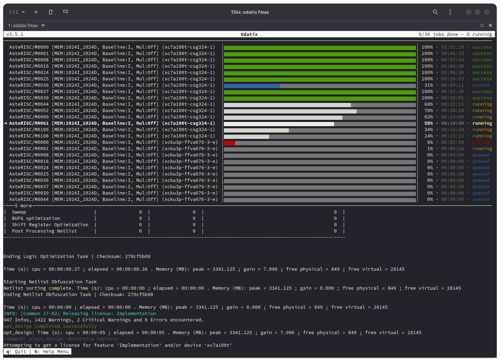
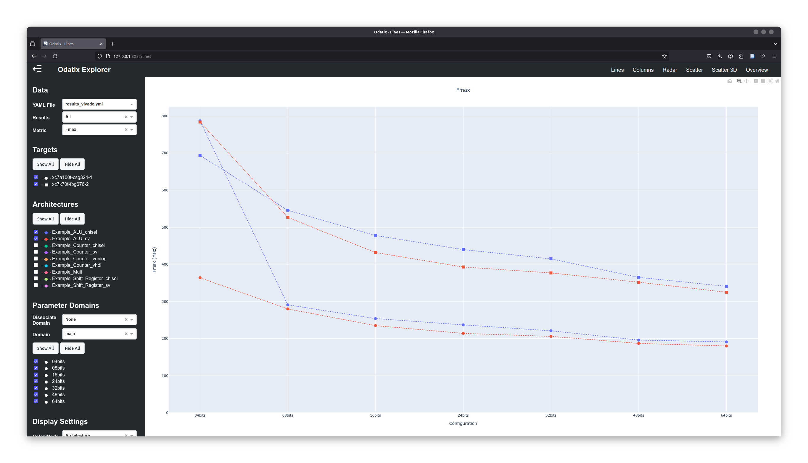
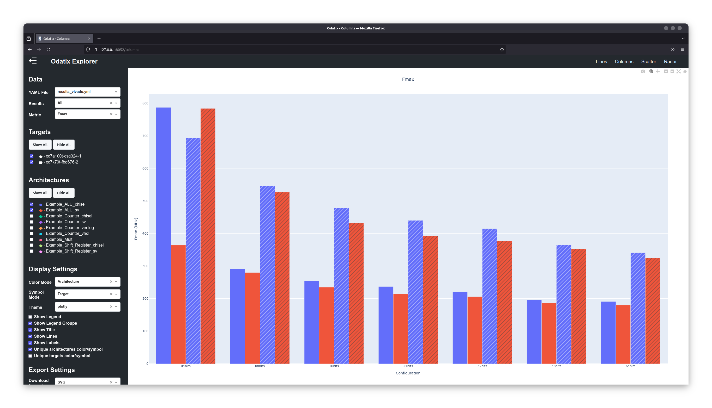
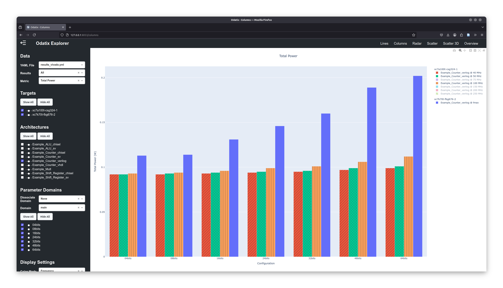
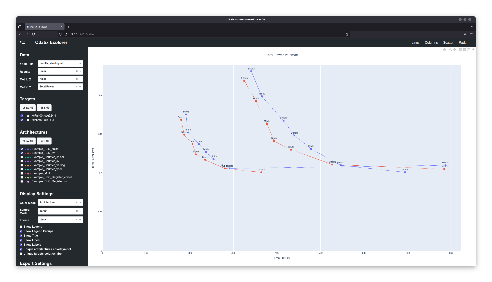
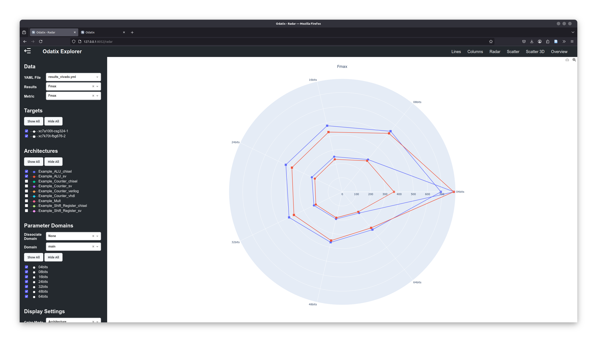

# Odatix

[](https://github.com/jsaussereau/Odatix)
[](https://pypi.org/project/odatix/)
[](https://www.sciencedirect.com/science/article/pii/S2352711024003406)
[](https://github.com/jsaussereau/Odatix/blob/main/LICENSE)
[](https://odatix.readthedocs.io)

**Odatix** is a **powerful tool** designed to facilitate **implementation** and **validation** of configurable digital designs across multiple **FPGA** and **ASIC** tools, including **Vivado**, **OpenLane**, and **Design Compiler**.

Odatix enables designers to:

- **Explore different architectural configurations** using parameter definition and generation.
- **Automatically find the maximum operating frequency** (`Fmax`) of any digital design.
- **Run logical synthesis for every desired clock speed** of any digital design.
- **Run simulations** to validate and benchmark your design.
- **Run simulation/synthesis jobs in parallel** to get results faster.
- **Compare architectures based on multiple metrics**, such as Fmax, power consumption, and resource utilization.
- **Visualize results interactively** in a web-based dashboard.

## 🚀 Key Features

✅ **Architecture Exploration**  
   - Easily define and generate multiple design configurations, regardless of the HDL used (**VHDL, Verilog, SystemVerilog**, and even **Chisel or HLS**).

✅ **Automated Synthesis**  
   - Run **synthesis on FPGA and/or ASIC tools** for **each configuration** of a design on various targets.
   - Perform **custom frequency synthesis** to analyze design behavior at specific clock speeds.
   - Automatically determine **maximum operating frequency (Fmax)**.

✅ **Efficient Simulation**  
   - Execute simulations for **each configuration** of a design.
   - **Validate** functionality and gather **benchmark** results.

✅ **Job Monitoring**  
   - **Track** parallel synthesis/simulation **jobs progress and logs** in real-time.
   - Start, pause, resume, or kill jobs effortlessly.

✅ **Interactive Results Exploration**  
   - **Analyze results visually** with built-in support for **line, column, scatter, and radar charts**.
   - Export charts in **vector** (SVG) or **raster** (PNG, JPEG, WEBP) **formats**.
   - Customize the appearance of your figures with different **themes**.

✅ **Quick Start**  
   - Install Odatix **easily** from PyPi with `pip install odatix`.
   - Use **built-in examples** and **step-by-step tutorials** to get started quickly.
   - Need help? [Contact us](mailto:jonathan.saussereau@ims-bordeaux.fr?Subject=[Odatix]) or open an issue on [GitHub](https://github.com/jsaussereau/Odatix/issues).

## 💡 Highlights

### 🖥️ **Job Monitor**
- Track **all running jobs** (synthesis or simulation) in a user-friendly interactive interface.
- **Live updates** of job progress and logs.
- **Full control**: start, pause, resume, or kill jobs at any time.



### 📊 **Odatix Explorer**
- **Interactive web interface** for deep result exploration.
- Compare architectures visually using **line, column, scatter, or radar charts**.
- **Export high-quality charts** in both **raster (PNG, JPEG, WEBP)** and **vector (SVG)** formats.

Examples:
- Fmax **comparison for various** ALU **designs and configurations** on two different FPGA targets:


- **Column chart** of Fmax for multiple ALU designs and configurations on different FPGA architectures:


- Power analysis **at different operating frequencies** for a multiple configurations of a counter:


- **Scatter plot**: Correlation between power consumption and Fmax for various ALU designs:


- **Radar chart**: Comparative analysis of **multiple implementation metrics** of multiple ALU configurations across two different FPGA targets:


## 🛠 Supported EDA Tools

> [!NOTE]
> Please note that these tools are not included in Odatix and must be obtained separately.

### **Synthesis**

| EDA Tool                                                       | Status              |
| :------------------------------------------------------------- | :------------------ |
| AMD Vivado                                                     | ✔️ supported        |
| Synopsys Design Compiler                                       | ✔️ supported        |
| [OpenLane 1](https://github.com/The-OpenROAD-Project/OpenLane) | ✔️ supported        |
| Intel Quartus Prime                                            | 📅 planned          |

### **Simulation**
Odatix can work with virtually **any simulator**.  
By default, **examples for Verilator and GHDL** are provided.

For more details, check the guide: [Add Simulation](https://odatix.readthedocs.io/en/latest/quick_start/add_simulation.html).

## 🏁 Get Started Today!

1️⃣ **Install Odatix and one of the supported EDA Tools**  
   Follow the instructions in [Installation Guide](https://odatix.readthedocs.io/en/latest/installation/index.html).

2️⃣ **Run a Quick Test on Built-in Examples**  
   Explore the [built-in examples](https://odatix.readthedocs.io/en/latest/quick_start/index.html).

3️⃣ **Define Your Own Architectures**  
   Use the [User Guide](https://odatix.readthedocs.io/en/latest/quick_start/index.html) to configure and run your own designs.

4️⃣ **Analyze Your Results**  
   Visualize your synthesis and simulation results with **Odatix Explorer**.

## 📰 Citation

**DOI**: [https://doi.org/10.1016/j.softx.2024.101970](https://www.sciencedirect.com/science/article/pii/S2352711024003406)

### **BibTeX**
```bibtex
@article{SAUSSEREAU2025101970,
  title = {Odatix: An open-source design automation toolbox for FPGA/ASIC implementation},
  journal = {SoftwareX},
  volume = {29},
  pages = {101970},
  year = {2025},
  issn = {2352-7110},
  doi = {https://doi.org/10.1016/j.softx.2024.101970},
  url = {https://www.sciencedirect.com/science/article/pii/S2352711024003406},
  author = {Jonathan Saussereau and Christophe Jego and Camille Leroux and Jean-Baptiste Begueret},
  keywords = {Design automation, Design space exploration, Hardware, Computer-aided design, Design flow, FPGA, ASIC}
}
```
---

## 📧 Contact

For any inquiries or support, feel free to contact me at jonathan.saussereau@ims-bordeaux.fr.

*Note: Odatix is under active development, and we appreciate your feedback and contributions to make it even more powerful and user-friendly.*
