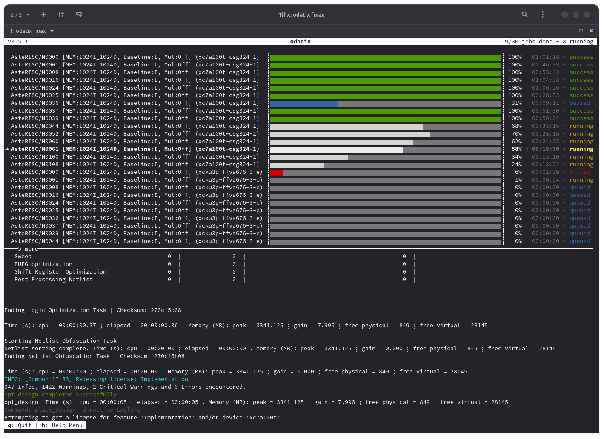
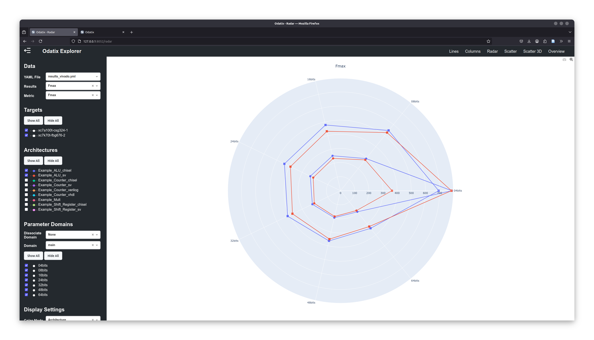
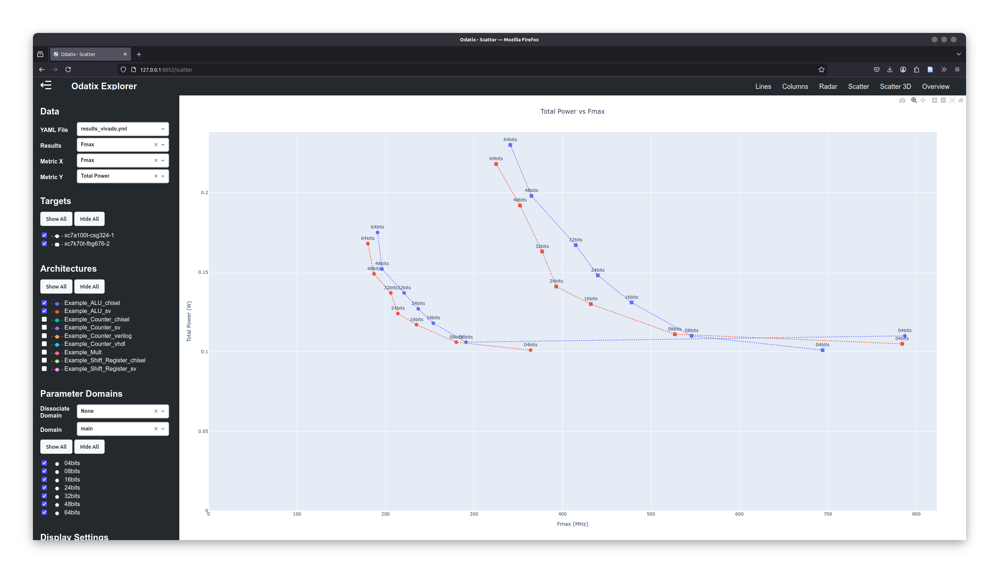

Odatix
========

.. |GitHub| image:: https://img.shields.io/badge/GitHub-Odatix-blue.svg?logo=github
  :target:  https://github.com/jsaussereau/Odatix

.. |PyPi| image:: https://img.shields.io/pypi/v/odatix
  :target:  https://pypi.org/project/odatix/

.. |Cite| image:: https://img.shields.io/badge/cite-DOI%3A10.1016/j.softx.2024.101970-green
  :target:  https://www.sciencedirect.com/science/article/pii/S2352711024003406
  
.. |License| image:: https://img.shields.io/github/license/jsaussereau/Odatix
  :target:  https://github.com/jsaussereau/Odatix/blob/main/LICENSE

.. |Docs| image:: https://readthedocs.org/projects/odatix/badge/?version=latest
  :target:  https://odatix.readthedocs.io

|GitHub| |PyPi| |Cite| |License| |Docs|

**Odatix** is a **powerful tool** designed to facilitate **implementation** and **validation** of configurable digital designs across multiple **FPGA** and **ASIC** tools, including **Vivado**, **OpenLane** and **Design Compiler**.

Odatix enables designers to:

- **Explore different architectural configurations** using parameter definition and generation.

- **Automatically find the maximum operating frequency** (`Fmax`) of any digital design.

- **Run logical synthesis for every desired clock speed** of any digital design.

- **Run simulations** to validate and benchmark your design.

- **Run simulation/synthesis jobs in parallel** to get results faster.

- **Compare architectures based on multiple metrics**, such as Fmax, power consumption, and resource utilization.

- **Visualize results interactively** in a web-based dashboard.

🚀 Key Features
----------------

✅ **Architecture Exploration**
   - Easily define and generate multiple design configurations, regardless of the HDL used (**VHDL, Verilog, SystemVerilog** and even **Chisel or HLS**).

✅ **Automated Synthesis**
   - Run **synthesis on FPGA and/or ASIC tools** for **each configuration** of a design on various targets.
   - Perform **custom frequency synthesis** to analyze design behavior at specific clock speeds.
   - Automatically determine **maximum operating frequency (Fmax)**.

✅ **Efficient Simulation**
   - Execute simulations for **each configuration** of a design.
   - **Validate** functionality and gather **benchmark** results.

✅ **Job Monitoring**
   - **Track** parallel synthesis/simulation **jobs progress and logs** in real-time.
   - Start, pause, resume, or kill jobs effortlessly.

✅ **Interactive Results Exploration**
   - **Analyze results visually** with built-in support for **line, column, scatter, and radar charts**.
   - Export charts in **vector** (SVG) or **raster** (PNG, JPEG, WEBP) **formats**.
   - Customize the appearance of your figures with different **themes**.

✅ **Quick Start**
   - :doc:`Install </installation/index>` Odatix **easily** from Pypi with pip.
   - Use **built-in examples** and :doc:`step-by-step tutorials </quick_start/index>` to get started quickly.
   - Need help? `Contact us <mailto:jonathan.saussereau@ims-bordeaux.fr?Subject=[Odatix]>`_ or open an issue on `GitHub <https://github.com/jsaussereau/Odatix>`_ for support.

💡 Highlights
--------------

🖥️ Job Monitor
~~~~~~~~~~~~~~~
- Track **all running jobs** (synthesis or simulation) in a user-friendly interactive interface.
- **Live updates** of job progress and logs.
- **Full control**: start, pause, resume, or kill jobs at any time.

  **Job Monitor** running an Fmax synthesis of various configurations of `AsteRISC <https://github.com/jsaussereau/AsteRISC>`_ on Vivado, targeting multiple FPGA architectures.

📊 Odatix Explorer
~~~~~~~~~~~~~~~~~~~

- **Interactive web interface** for deep result exploration.
- Compare architectures visually using **line, column, scatter, or radar charts**.
- **Export high-quality charts** in both **raster (PNG, JPEG, WEBP)** and **vector (SVG)** formats.

.. figure:: ../../sources/images/odatix-explorer/odatix-explorer-lines.png
  :width: 100%

  **Line chart** of a metric (Fmax here) for multiple designs and configurations on different targets (FPGA here)

.. figure:: ../../sources/images/odatix-explorer/odatix-explorer-columns.png
  :width: 100%

  **Column chart** of a metric (Fmax here) for multiple designs and configurations on different targets (FPGA here)

  **Radar chart** of a metric (Fmax here) for multiple designs and configurations on different targets (FPGA here)

.. figure:: ../../sources/images/odatix-explorer/odatix-explorer-columns-freq.png
  :width: 100%

  Compararison of a metric (power consumption here) **at different operating frequencies** for multiple designs and configurations on different targets (FPGA here)

  **Scatter plot**: Correlation between 2 metrics (power consumption and Fmax here)for multiple designs and configurations on different targets (FPGA here)

  **Scatter 3D plot**: Correlation between 3 metrics (LUT count, register counter and Fmax here) for multiple designs and configurations on different targets (FPGA here)

  **Overview**: Comparative analysis of **multiple implementation metrics** for multiple designs and configurations on different targets (FPGA here)

🛠 Supported EDA Tools
----------------------

.. note::
  Please note that these tools are not included in Odatix and must be obtained separately.

Synthesis
~~~~~~~~~

Odatix supports synthesis on the following tools:

.. list-table::
  :header-rows: 1

  * - **EDA Tool**
    - **Support Status**
  * - **AMD Vivado**
    - ✔️ Supported
  * - **Synopsys Design Compiler**
    - ✔️ Supported
  * - `OpenLane 1 <https://github.com/The-OpenROAD-Project/OpenLane>`_
    - ✔️ Supported
  * - `F4PGA <https://github.com/chipsalliance/f4pga>`_
    - 📅 Planned
  * - **Intel Quartus Prime**
    - 📅 Planned

Simulation
~~~~~~~~~~

Odatix can work with virtually **any simulator**.  
By default, **examples for Verilator and GHDL** are provided.

For more details, check the guide: :doc:`/quick_start/add_simulation`.

🏁 Get Started Today!
----------------------

1️⃣ **Install Odatix and one of the supported EDA Tools**  

Follow the instructions in :doc:`/installation/index`.

2️⃣ **Run a Quick Test on Built-in Examples**  

Explore the :doc:`built-in examples </quick_start/index>`.

3️⃣ **Define Your Own Architectures**  

Use the :doc:`guide </quick_start/index>` to configure and run your own designs.

4️⃣ **Analyze Your Results**  

Visualize your synthesis and simulation results with **Odatix Explorer**.

📖 Documentation Contents
--------------------------

.. toctree::
  :maxdepth: 2

  installation/index
  quick_start/index
  userguide/index
  documentation/commands
  documentation/settings
  
📰 Citation
------------

**DOI**: `https://doi.org/10.1016/j.softx.2024.101970 <https://www.sciencedirect.com/science/article/pii/S2352711024003406>`_

.. tab:: Text

  .. code-block::

    Jonathan Saussereau, Christophe Jego, Camille Leroux, Jean-Baptiste Begueret,
    Odatix: An open-source design automation toolbox for FPGA/ASIC implementation,
    SoftwareX,
    Volume 29,
    2025,
    101970,
    ISSN 2352-7110,
    https://doi.org/10.1016/j.softx.2024.101970.
    (https://www.sciencedirect.com/science/article/pii/S2352711024003406)
    Abstract: In modern hardware digital design, optimizing performance, resource utilization, and power consumption across different technological targets remains a critical challenge. Indeed, the drive for greater computational power, alongside the need to reduce power consumption, stems from a wide range of applications, from data centers to mobile devices. However, this push encounters significant cost barriers, as the manufacturing cost is closely tied to the technological nodes used and the area for integrated circuits, and is particularly influenced by the amount of available resources for FPGAs. These three criteria are inherently conflicting, as improving one often negatively impacts the others. Finding the best balance between these factors requires significant effort. To address these complexities, design automation tools are increasingly valuable. Odatix is an open-source toolbox designed for the automated implementation and validation of parametrizable digital architectures. It supports synthesis, placement and routing for various FPGA and ASIC tools and simulators. It simplifies key stages such as synthesis, place and route, simulation, and validation, allowing designers to efficiently navigate multiple configurations and identify optimal solutions tailored to specific application constraints. Indeed, Odatix enables comparative analysis of multiple architectural configurations through various metrics such as maximum operating frequency, resource utilization, and power consumption. This paper presents an overview of Odatix’s capabilities and its application to the AsteRISC processor, demonstrating its utility in choosing the best architectural configuration, technological target and EDA tool for specific application constraints.
    Keywords: Design automation; Design space exploration; Hardware; Computer-aided design; Design flow; FPGA; ASIC

.. tab:: BibTeX

  .. code-block:: tex

    @article{SAUSSEREAU2025101970,
    title = {Odatix: An open-source design automation toolbox for FPGA/ASIC implementation},
    journal = {SoftwareX},
    volume = {29},
    pages = {101970},
    year = {2025},
    issn = {2352-7110},
    doi = {https://doi.org/10.1016/j.softx.2024.101970},
    url = {https://www.sciencedirect.com/science/article/pii/S2352711024003406},
    author = {Jonathan Saussereau and Christophe Jego and Camille Leroux and Jean-Baptiste Begueret},
    keywords = {Design automation, Design space exploration, Hardware, Computer-aided design, Design flow, FPGA, ASIC},
    abstract = {In modern hardware digital design, optimizing performance, resource utilization, and power consumption across different technological targets remains a critical challenge. Indeed, the drive for greater computational power, alongside the need to reduce power consumption, stems from a wide range of applications, from data centers to mobile devices. However, this push encounters significant cost barriers, as the manufacturing cost is closely tied to the technological nodes used and the area for integrated circuits, and is particularly influenced by the amount of available resources for FPGAs. These three criteria are inherently conflicting, as improving one often negatively impacts the others. Finding the best balance between these factors requires significant effort. To address these complexities, design automation tools are increasingly valuable. Odatix is an open-source toolbox designed for the automated implementation and validation of parametrizable digital architectures. It supports synthesis, placement and routing for various FPGA and ASIC tools and simulators. It simplifies key stages such as synthesis, place and route, simulation, and validation, allowing designers to efficiently navigate multiple configurations and identify optimal solutions tailored to specific application constraints. Indeed, Odatix enables comparative analysis of multiple architectural configurations through various metrics such as maximum operating frequency, resource utilization, and power consumption. This paper presents an overview of Odatix’s capabilities and its application to the AsteRISC processor, demonstrating its utility in choosing the best architectural configuration, technological target and EDA tool for specific application constraints.}
    }

.. tab:: RIS

  .. code-block::

    TY  - JOUR
    T1  - Odatix: An open-source design automation toolbox for FPGA/ASIC implementation
    AU  - Saussereau, Jonathan
    AU  - Jego, Christophe
    AU  - Leroux, Camille
    AU  - Begueret, Jean-Baptiste
    JO  - SoftwareX
    VL  - 29
    SP  - 101970
    PY  - 2025
    DA  - 2025/02/01/
    SN  - 2352-7110
    DO  - https://doi.org/10.1016/j.softx.2024.101970
    UR  - https://www.sciencedirect.com/science/article/pii/S2352711024003406
    KW  - Design automation
    KW  - Design space exploration
    KW  - Hardware
    KW  - Computer-aided design
    KW  - Design flow
    KW  - FPGA
    KW  - ASIC
    AB  - In modern hardware digital design, optimizing performance, resource utilization, and power consumption across different technological targets remains a critical challenge. Indeed, the drive for greater computational power, alongside the need to reduce power consumption, stems from a wide range of applications, from data centers to mobile devices. However, this push encounters significant cost barriers, as the manufacturing cost is closely tied to the technological nodes used and the area for integrated circuits, and is particularly influenced by the amount of available resources for FPGAs. These three criteria are inherently conflicting, as improving one often negatively impacts the others. Finding the best balance between these factors requires significant effort. To address these complexities, design automation tools are increasingly valuable. Odatix is an open-source toolbox designed for the automated implementation and validation of parametrizable digital architectures. It supports synthesis, placement and routing for various FPGA and ASIC tools and simulators. It simplifies key stages such as synthesis, place and route, simulation, and validation, allowing designers to efficiently navigate multiple configurations and identify optimal solutions tailored to specific application constraints. Indeed, Odatix enables comparative analysis of multiple architectural configurations through various metrics such as maximum operating frequency, resource utilization, and power consumption. This paper presents an overview of Odatix’s capabilities and its application to the AsteRISC processor, demonstrating its utility in choosing the best architectural configuration, technological target and EDA tool for specific application constraints.
    ER  - 

📧 Contact
-----------

For any inquiries or support, feel free to contact me at `jonathan.saussereau@ims-bordeaux.fr <mailto:jonathan.saussereau@ims-bordeaux.fr?Subject=[Odatix]>`_.
